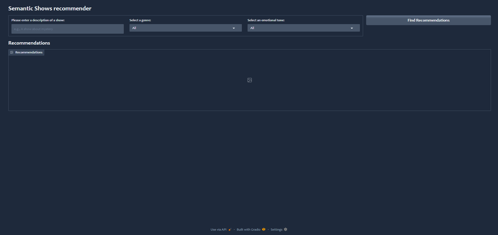
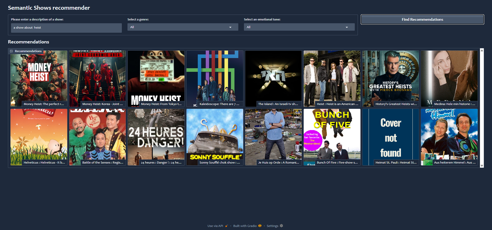
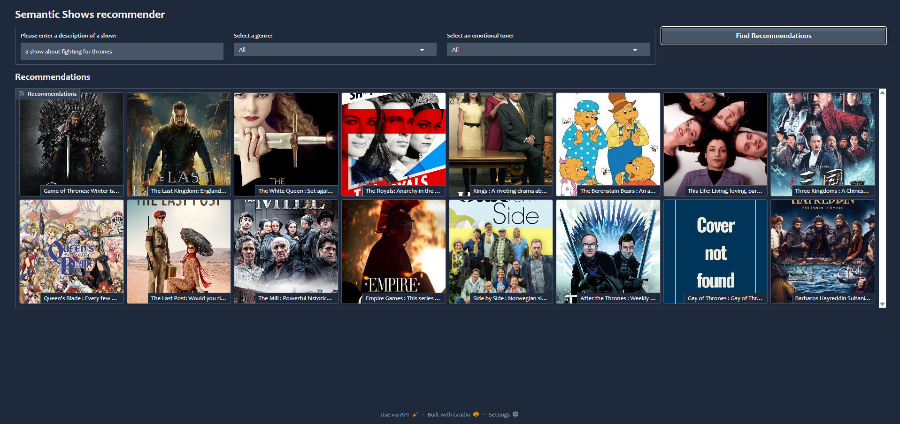

📺 TV Show Recommendation System

    A machine learning-powered TV Show Recommendation System that suggests TV shows based on user preferences using advanced recommendation algorithms. The system incorporates content-based filtering, collaborative filtering, and sentiment analysis.

Features

    ✅ Content-Based Filtering – Recommends shows based on similar genres and descriptions.
    ✅ Collaborative Filtering – Suggests shows based on other users' viewing patterns.
    ✅ Sentiment Analysis – Analyzes user reviews to enhance recommendations.
    ✅ Vector Search –     Uses embedding-based similarity for more personalized results.
    ✅ Gradio Dashboard – A user-friendly interactive interface.

Project Structure

    📁 data-exploration.ipynb – Data cleaning & visualization.
    📁 vector-search.ipynb – Implementation of vector embeddings & similarity search.
    📁 gradio-dashboard.py – Interactive UI for recommendations.
    📁 sentiment-analysis.ipynb – Sentiment analysis on TV show reviews.
    📁 text-classification.ipynb – NLP-based classification model for review analysis.

Installation & Setup

    Clone the repository:

    git clone https://github.com/Frankly03/TV_Show-Recommendation-System.git
    cd TV-Show-Recommendation-System

Usage

    Run the Gradio-based dashboard:

    python gradio-dashboard.py

How It Works

    The system processes TV show data, extracts relevant features, and applies recommendation techniques to suggest shows tailored to user preferences. It supports both content-based filtering and collaborative filtering, while sentiment analysis improves recommendation accuracy.

    📸 Screenshots

    🔹 Recommendation System Interface
        
        
    🔹 Sample Results
        
        

